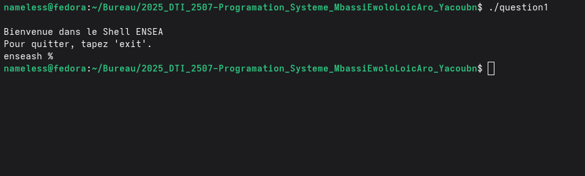
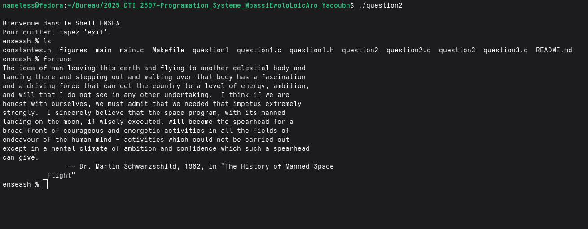

# TP - Micro Shell ENSEA

**Auteurs :** MBASSI EWOLO LOIC ARON, ABDOULKADER Yacoub
**Date :** Décembre 2025  
**Cours :** Programmation Système

---

## Description du projet

Ce projet consiste à développer un **micro shell** appelé `enseash`, capable d'exécuter des commandes et d'afficher des informations sur leur exécution (codes de sortie, signaux, temps d'exécution).

---

## Compilation

```bash
make
```

---

## Questions réalisées

### Question 1 : Affichage du message d'accueil et prompt simple ✅

**Objectif :** Afficher un message de bienvenue au lancement du shell, suivi d'un prompt simple.

**Fichier :** `question1.c`

**Exécution :**
```bash
./question1
```

**Résultat attendu :**
```
Bienvenue dans le Shell ENSEA.
Pour quitter, tapez 'exit'.
enseash %
```

**Capture d'écran :**



**Explication :**
- Utilisation de `write()` pour afficher les messages (pas de `printf`)
- Affichage du prompt `enseash %`
- Le programme attend une entrée utilisateur (mais ne fait rien encore)

---

### Question 2 : Exécution de commandes simples (REPL) ✅

**Objectif :** Implémenter la boucle REPL (Read-Eval-Print Loop) pour exécuter des commandes simples sans arguments.

**Fichier :** `question2.c`

**Exécution :**
```bash
./question2
```

**Fonctionnalités :**
- Lecture de la commande saisie avec `read()`
- Exécution d'une commande simple (sans arguments) avec `fork()` et `execlp()`
- Retour au prompt après l'exécution
- Boucle infinie pour exécuter plusieurs commandes

**Exemple d'utilisation :**
```
enseash % date
dim. 08 déc. 2025 15:30:00 CET
enseash % ls
main.c  Makefile  question1.c
enseash % pwd
/home/nameless/Bureau/2025_DTI_2507-Programation_Systeme_MbassiEwoloLoicAro_Yacoubn
enseash % [Ctrl+D pour quitter]
```

**Capture d'écran :**



**Explication technique :**
- **`fork()`** : Création d'un processus fils pour exécuter la commande
  - Le processus fils exécute `execlp(commande, commande, NULL)`
  - Le processus parent attend la fin du fils avec `wait(NULL)`
- **Pourquoi fork ?** Sans `fork()`, `execlp()` remplacerait le shell lui-même, le faisant disparaître après la première commande
- **Sortie :** Ctrl+D (EOF) pour quitter le shell

---

### Question 3 : Gestion de la sortie avec `exit` et Ctrl+D ✅

**Objectif :** Permettre à l'utilisateur de quitter le shell proprement avec la commande `exit` ou le raccourci Ctrl+D.

**Fichier :** `question3.c`

**Exécution :**
```bash
./question3
```

**Fonctionnalités ajoutées :**
- Détection de la commande `exit` pour quitter
- Détection de Ctrl+D (EOF) pour quitter
- Message de sortie "Bye Bye"

**Exemple d'utilisation :**
```
enseash % date
dim. 08 déc. 2025 15:30:00 CET
enseash % exit
Bye Bye
```

Ou avec Ctrl+D :
```
enseash % date
dim. 08 déc. 2025 15:30:00 CET
enseash % [Ctrl+D]
Bye Bye
```

**Capture d'écran :**


**Explication technique :**
- **Détection de `exit` :** Utilisation de `strcmp(commande, "exit")`
- **Détection de Ctrl+D :** Quand l'utilisateur tape Ctrl+D, `read()` retourne 0 (EOF)
```c
if (taille_commande <= 0) {
    write(1, "\nBye Bye\n", 9);
    break;
}
```
- **Ctrl+D** envoie un signal EOF (End Of File) qui indique qu'il n'y a plus rien à lire

---

## Structure du code

```
.
├── Makefile              # Compilation du projet
├── constantes.h          # Définition des constantes
├── question1.h           # Header pour fonctions communes
├── question1.c           # Question 1
├── question2.c           # Question 2
├── question3.c           # Question 3
├── main.c                # Version en cours de développement
└── README.md             # Ce fichier
```

---

## Questions restantes

- [ ] Question 5 : Mesure du temps d'exécution
- [ ] Question 6 : Gestion des arguments de commande
- [ ] Question 7 : Redirections et pipes

