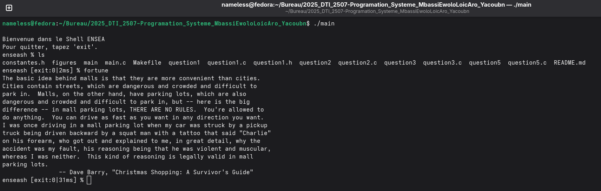
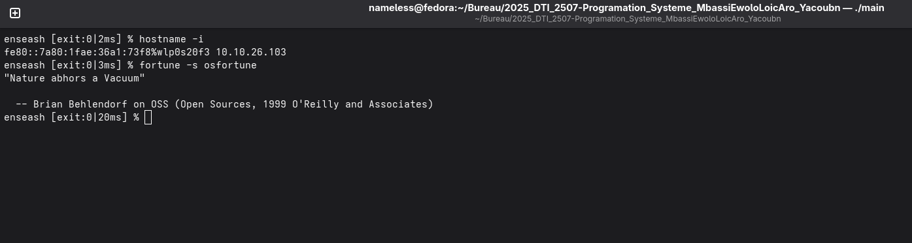
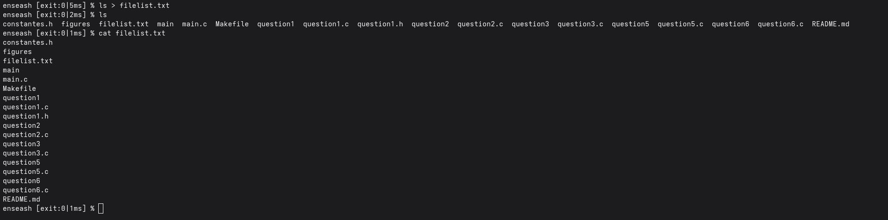
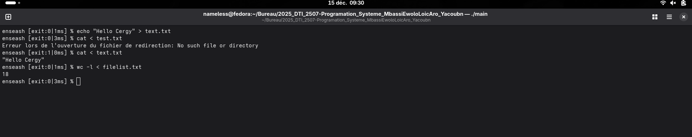
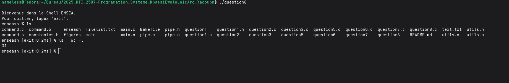
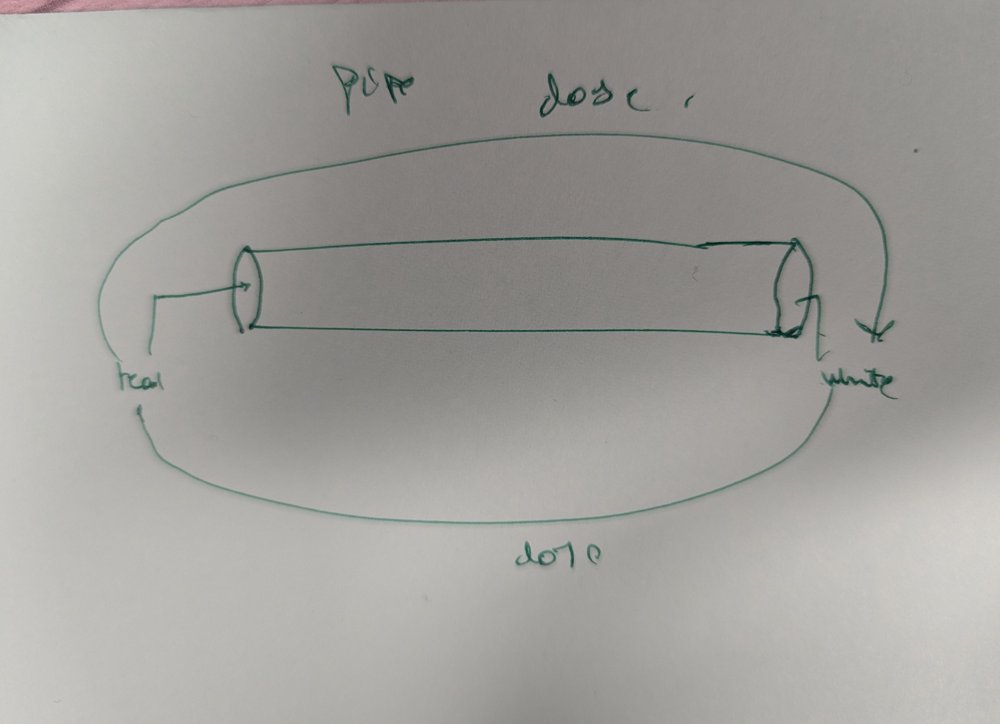

# TP - Micro Shell ENSEA

- **Auteurs :** MBASSI EWOLO LOIC ARON, ABDOULKADER Yacoub
- **Date :** Decembre 2025  
- **Cours :** Programmation Systeme

---

## Description du projet

Ce projet consiste a developper un **micro shell** appele `enseash`, capable d'executer des commandes et d'afficher des informations sur leur execution (comme codes de sortie, signaux, temps d'execution).

---

## Compilation

```bash
make
```

---

## Questions realisees

### Question 1 : Affichage du message d'accueil
**Objectif :** Afficher un message de bienvenue au lancement du shell, suivi d'un 

**Fichier :** `question1.c`

**Execution :**
```bash
./question1
```

**Resultat attendu :**
```
Bienvenue dans le Shell ENSEA.
Pour quitter, tapez 'exit'.
enseash %
```

**Capture d'ecran :**


**Explication :**
- Utilisation de `write()` pour afficher les messages (pas de `printf`)
- Affichage de la commande `enseash %`
- Le programme attend une entree utilisateur (mais ne fait rien encore)

---

### Question 2 : Execution de commandes simples (REPL)

**Objectif :** Implementer la boucle REPL (Read-Eval-Print Loop) pour executer des commandes simples sans arguments.

**Fichier :** `question2.c`

**Execution :**
```bash
./question2
```

**Fonctionnalites :**
- Lecture de la commande saisie avec `read()`
- Execution d'une commande simple (sans arguments) avec `fork()` et `execlp()`
- Retour au prompt apres l'execution
- Boucle infinie pour executer plusieurs commandes

**Exemple d'utilisation :**
```
enseash % date
dim. 08 dec. 2025 15:30:00 CET
enseash % ls
main.c  Makefile  question1.c
enseash % pwd
/home/nameless/Bureau/2025_DTI_2507-Programation_Systeme_MbassiEwoloLoicAro_Yacoubn
enseash % [Ctrl+D pour quitter]
```

**Capture d'ecran :**


**Explication technique :**
- **`fork()`** : Creation d'un processus fils pour executer la commande
  - Le processus fils execute `execlp(commande, commande, NULL)`
  - Le processus parent attend la fin du fils avec `wait(NULL)`
- **Pourquoi fork ?** Sans `fork()`, `execlp()` remplacerait le shell lui-meme, le faisant disparaitre apres la premiere commande
- **Sortie :** Ctrl+D (EOF) pour quitter le shell

---

### Question 3 : Gestion de la sortie avec `exit` et Ctrl+D

**Objectif :** Permettre a l'utilisateur de quitter le shell proprement avec la commande `exit` ou le raccourci Ctrl+D.

**Fichier :** `question3.c`

**Execution :**
```bash
./question3
```

**Fonctionnalites ajoutees :**
- Detection de la commande `exit` pour quitter
- Detection de Ctrl+D (EOF) pour quitter
- Message de sortie "Bye Bye"

**Exemple d'utilisation :**
```
enseash % date
dim. 08 dec. 2025 15:30:00 CET
enseash % exit
Bye Bye
```

Ou avec Ctrl+D :
```
enseash % date
dim. 08 dec. 2025 15:30:00 CET
enseash % [Ctrl+D]
Bye Bye
```

**Explication technique :**
- **Detection de `exit` :** Utilisation de `strcmp(commande, "exit")`
- **Detection de Ctrl+D :** Quand l'utilisateur tape Ctrl+D, `read()` retourne 0 (EOF)
```c
if (taille_commande <= 0) {
    write(1, "\nBye Bye\n", 9);
    break;
}
```
- **Ctrl+D** envoie un signal EOF (End Of File) qui indique qu'il n'y a plus rien a lire

---

### Question 4 : Affichage du code de retour ou du signal

**Objectif :** Afficher dans le prompt le code de sortie de la commande precedente, ou le signal si elle a ete tuee.

**Fichier :** `question5.c` (inclut aussi la question 5)

**Execution :**
```bash
./question5
```

**Format de la commande :**
- Sortie normale : `enseash [exit:X] %` ou X est le code de retour
- Tuee par signal : `enseash [sign:X] %` ou X est le numero du signal

**Exemple d'utilisation :**
```
enseash % ls
main.c  Makefile
enseash [exit:0] % ls /dossier_inexistant
ls: cannot access '/dossier_inexistant': No such file or directory
enseash [exit:2] %
```

**Explication technique :**
- Utilisation de `waitpid(pid, &status, 0)` pour recuperer le status
- `WIFEXITED(status)` : verifie si le processus s'est termine normalement
- `WEXITSTATUS(status)` : recupere le code de sortie
- `WIFSIGNALED(status)` : verifie si le processus a ete tue par un signal
- `WTERMSIG(status)` : recupere le numero du signal

---

### Question 5 : Mesure du temps d'execution

**Objectif :** Afficher le temps d'execution de chaque commande dans le prompt.

**Fichier :** `question5.c`

**Execution :**
```bash
./question5
```

**Format de la commande :**
```
enseash [exit:X|Yms] %
```
ou X est le code de retour et Y le temps en millisecondes.

**Capture d'ecran :**



**Exemple d'utilisation :**
```
enseash % ls
main.c  Makefile
enseash [exit:0|5ms] % sleep 1
enseash [exit:0|1003ms] %
```

**Explication technique :**
- Utilisation de `clock_gettime(CLOCK_REALTIME, &timespec)` pour mesurer le temps
- Mesure avant le `fork()` et apres le `waitpid()`
- Calcul : `(end.tv_sec - start.tv_sec) * 1000 + (end.tv_nsec - start.tv_nsec) / 1000000`
- Necessite `#define _POSIX_C_SOURCE 199309L` avant les includes

---

### Question 6 : Gestion des arguments de commande

**Objectif :** Permettre l'execution de commandes avec arguments (ex: `ls -l`, `echo hello`).

**Fichier :** `question6.c`

**Execution :**
```bash
./question6
```

**Capture d'ecran :**



**Exemple d'utilisation :**
```
enseash % ls -l
total 48
-rw-r--r-- 1 user user 1234 main.c
enseash [exit:0|8ms] % echo hello world
hello world
enseash [exit:0|2ms] %
```

**Explication :**
- Fonction `parse_command()` pour decouper la commande en tokens
- Utilisation de `strtok()` avec le delimiteur espace
- Remplacement de `execlp()` par `execvp(args[0], args)`
- Le tableau `args` doit se terminer par `NULL`

```c
void parse_command(char *commande, char **args) {
    int i = 0;
    char *token = strtok(commande, " ");
    while (token != NULL && i < MAX_ARGS - 1) {
        args[i++] = token;
        token = strtok(NULL, " ");
    }
    args[i] = NULL;
}
```

---

### Question 7 : Redirections

**Objectif :** Gerer les redirections d'entree (`<`) et de sortie (`>`).

**Fichier :** `main.c`

**Execution :**
```bash
./main
```

**Capture d'ecran :**





**Exemple d'utilisation :**
```
enseash % echo "Hello World" > output.txt
enseash [exit:0|3ms] % cat < output.txt
Hello World
enseash [exit:0|2ms] % cat < input.txt > output.txt
enseash [exit:0|4ms] %
```

**Explication technique :**
- Detection des symboles `<` et `>` dans les arguments
- Utilisation de `open()` pour ouvrir les fichiers :
  - `<` : `open(fichier, O_RDONLY)`
  - `>` : `open(fichier, O_WRONLY | O_CREAT | O_TRUNC, 0644)`
- Utilisation de `dup2()` pour rediriger les descripteurs :
  - `dup2(fd, STDIN_FILENO)` pour la redirection d'entree
  - `dup2(fd, STDOUT_FILENO)` pour la redirection de sortie
- Suppression des symboles de redirection et noms de fichiers du tableau d'arguments avant `execvp()`

```c
void handle_redirections(char **args) {
    int i = 0;
    while (args[i] != NULL) {
        if (strcmp(args[i], "<") == 0) {
            int fd = open(args[i + 1], O_RDONLY);
            dup2(fd, STDIN_FILENO);
            close(fd);
        }
        else if (strcmp(args[i], ">") == 0) {
            int fd = open(args[i + 1], O_WRONLY | O_CREAT | O_TRUNC, 0644);
            dup2(fd, STDOUT_FILENO);
            close(fd);
        }
        else {
            i++;
        }
    }
}
```

---

### Question 8 : Gestion des pipes

**Objectif :** Gerer les redirections de type pipe avec `|` pour chainer des commandes.

**Fichier :** `question8.c` / `enseash`

**Execution :**
```bash
./enseash
```

**Capture d'ecran :**



**Exemple d'utilisation :**
```
enseash % ls | wc -l
15
enseash [exit:0|5ms] % cat main.c | grep include
#include <stdio.h>
#include <time.h>
#include <unistd.h>
#include <stdlib.h>
#include <string.h>
#include <stdbool.h>
#include <sys/wait.h>
#include <sys/types.h>
// Custom includes
#include "question1.h"
#include "constantes.h"
#include "utils.h"
#include "command.h"
#include "pipe.h"
enseash [exit:0|4ms] %
```

**Explication:**

Le pipe permet de connecter la sortie standard d'une commande a l'entree standard d'une autre :


```
  Ex :        cmd1              pipe              cmd2
               (ls)                               (wc -l)
                  stdout --> pipefd[1] ====> pipefd[0] --> stdin
```

**Implementation :**

1. **Detection du pipe** : `has_pipe()` verifie si la commande contient `|`

2. **Creation du pipe** : `pipe(pipefd)` cree un tuyau avec deux extremites :
   - `pipefd[0]` : extremite lecture
   - `pipefd[1]` : extremite ecriture

3. **Deux processus fils** :
   - **Enfant 1** : execute `cmd1`, redirige stdout vers `pipefd[1]`
   - **Enfant 2** : execute `cmd2`, redirige stdin depuis `pipefd[0]`


**Pourquoi fermer les descripteurs ?**
- Chaque processus doit fermer les extremites du pipe qu'il n'utilise pas
- Si le parent ne ferme pas le pipe, `cmd2` attendra indefiniment (pensant que des donnees peuvent encore arriver)

---

## Structure du projet

```
.
├── Makefile              # Compilation du projet
├── constantes.h          # Definition des constantes (TAILLE_MAX_COMMANDE, MAX_ARGS)
├── question1.h           # Header pour fonctions communes (print_welcome_message)
├── utils.h / utils.c     # Fonction write_int()
├── command.h / command.c # Fonctions parse_command(), handle_redirection()
├── pipe.h / pipe.c       # Fonctions has_pipe(), execute_pipe()
├── question1.c           # Question 1 : Message d'accueil
├── question2.c           # Question 2 : Boucle REPL
├── question3.c           # Question 3 : Gestion exit et Ctrl+D
├── question5.c           # Questions 4-5 : Code retour et temps
├── question6.c           # Question 6 : Arguments
├── question7.c           # Question 7 : Redirections
├── question8.c           # Question 8 : Pipes
├── main.c                # Version finale (enseash)
├── figures/              # Captures d'ecran
│   ├── question1.png
│   ├── question2.png
│   ├── question5.png
│   ├── question6.png
│   ├── question7.png
│   ├── question7_b.png
│   └── question8.png
└── README.md             # Ce fichier
```

---

## Appels systeme utilises

| Fonction | Description |
|----------|-------------|
| `write()` | Ecriture sur un descripteur de fichier |
| `read()` | Lecture depuis un descripteur de fichier |
| `fork()` | Creation d'un processus fils |
| `execvp()` | Execution d'une commande avec arguments |
| `waitpid()` | Attente de la fin d'un processus fils |
| `clock_gettime()` | Mesure du temps |
| `open()` | Ouverture d'un fichier |
| `dup2()` | Duplication de descripteur de fichier |
| `close()` | Fermeture d'un descripteur de fichier |
| `pipe()` | Creation d'un pipe |
| `strtok()` | Decoupage de chaine en tokens |
| `strchr()` | Recherche d'un caractere dans une chaine |

---

## Auteurs

- MBASSI EWOLO LOIC ARON
- ABDOULKADER Yacoub

---

## Depot GitHub

https://github.com/Nameless0l/2025_DTI_2507-Programation_Systeme_MbassiEwoloLoicAro_Yacoub

